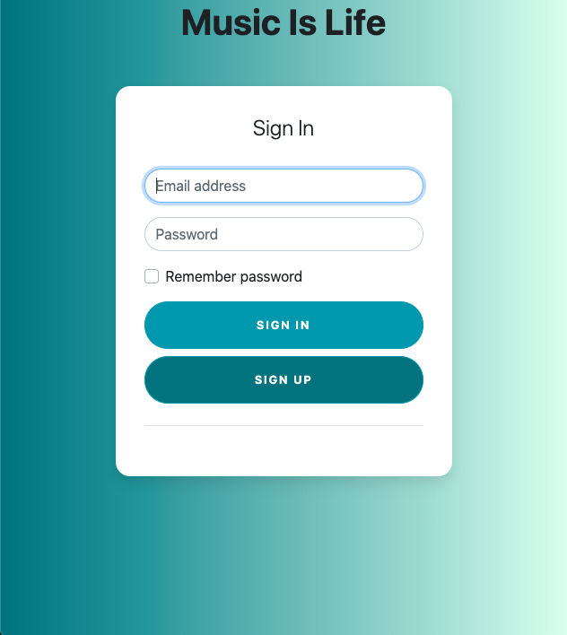
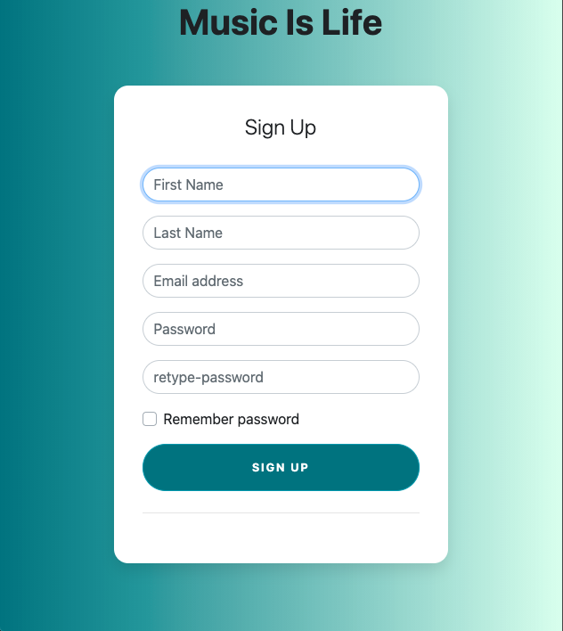
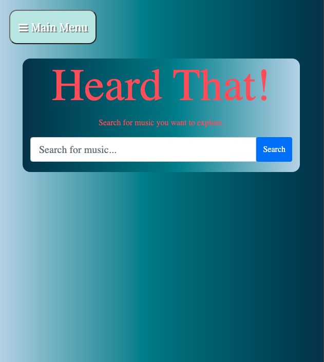
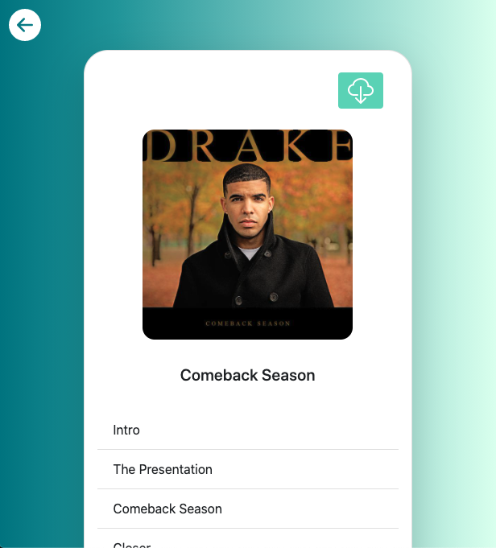

# HeardThat

HeardThat is a music exploration tool that allow the
user to search for their favorite albums out of thousands 
and add them to their personal playlist to reference later
each album also has its own link to buy artist merch or buy 
a physical copy of that album right from amazon. Enjoy!

## Installation

```bash
git clone https://github.com/bargavi-dev/front-end-project.git
code .
```
Finally just open in your browser

## Contributing
Pull requests are welcome. For major changes, please open an issue first to discuss what you would like to change.

Please make sure to update tests as appropriate.

## Team members
* <a href="https://github.com/Varobinson">Vincent Robinson</a>
* <a href="https://github.com/bargavi-dev">Bargavi Kanneganti</a>
* <a href="https://github.com/JaxAttaxx">Jax Godwin</a>


## Languages and Technologies used
* JavaScript
* jQuery
* HTML
* CSS

## Api
* Music Brainz
* Cover Art Archive
* Amazon
* Merch Bar

## Site Walkthrough

### Sign In
when you first navigate to the site you 
are able sign in with your username 
and password

<p align='center'>
    </img>
</p>

### Sign Up
If you are a new user here you will be able
to create a new user after giving us 
a little information

<p align='center'>
    </img>
</p>

### Deck
Here is the main page you will navigate through
in order to reach all other pages 

<p align='center'>
    </img>
</p>

### Search For Artists
This is the page where you can search for an artist 
and a list of albums will appear

<p align='center'>
    </img>
</p>

### Search For Artists
This is the page where the album you select will 
appear with cover art, a track list , links to buy
merch or the album itself and also sve the album to
your music page

<p align='center'>
    </img>
</p>

### My Music
Here is where you will have stored
your favorite albums 

<p align='center'>
    </img>
</p>

### About
This is the about page that tells you a bit about 
our company


<p align='center'>
    </img>
</p>